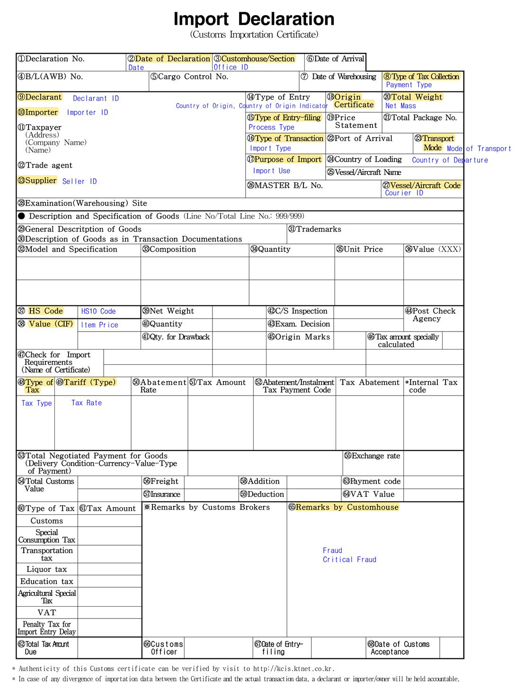

## Customs Import Declaration Datasets [[English]](https://github.com/Seondong/Customs-Declaration-Datasets/tree/en) [[Korean]](https://github.com/Seondong/Customs-Declaration-Datasets/tree/main)

Given the huge volume of cross-border flows, effective controlling of trades becomes more crucial in customs administrations. However, limited accessibility of the customs datasets hinders the progress of open research and lots of member countries have not benefited from the recent progress. We introduce an [import declarations dataset](./data/df_syn_eng.csv) to facilitate the collaboration between the domain experts in customs administrations and data science researchers. The dataset contains 54,000 artificially generated trades with 21 key attributes and it is synthesized with CTGAN while maintaining correlated attributes. The fabrication step minimizes the possible identity risk which may exist in trade statistics and the published data follow a similar distribution to the source data so that it can be used in various downstream tasks. See our paper: [Customs Import Declaration Datasets](./paper.pdf) for more details.

### Data Schema
Among 24.7 million customs declarations reported for 18 months between January 1, 2020 and June 30, 2021, we used the inspected
(i.e., labeled) part of the declarations to synthesize [this dataset](./data/df_syn_eng.csv). Each row describes the report of a single goods. Among 62 attributes in the [import declaration form](./import_declaration_form.pdf), the data includes 21 representative
attributes including two labels, fraud and critical fraud. Detailed data descriptions are as follows.

| Attribute               | Description                                              |
| ------------------ | ------------------------------------------------- |
| Date           | Date when the declaration is reported                           |
| Office ID       | Customs office that receives the declaration (e.g., Seoul regional customs)                               |
| Process type | Type of the declaration process (e.g., Paperless declaration) |
| Import type | Code for import type (e.g., OEM import, E-commerce)                         |
| Import use | Code for import use (e.g., Raw materials for domestic consumption)     |
| Payment type | Distinguish tariff payment type (e.g., Usance credit payable at sight)                        |
| Mode of transport | Nine modes of transport (e.g., maritime, rail, air)              |
| Declarant ID | Person who declares the item                  |
| Importer ID | Consumer who imports the item                             |
| Seller ID | Overseas business partner which supplies goods to Korea                           |
| Courier ID | Delivery service provider (e.g., DHL, FedEx)                     |
| HS10 code | 10-digit product code (e.g., 090121xxxx = Coffee, Roasted, Not Decaffeinated)                             |
| Country of departure | Country from which a shipment has or is scheduled to depart             |
| Country of origin | Country of manufacture, production or design, or where an article or product comes from                            |
| Tax rate | Tax rate of the item (%)                              |
| Tax type | Tax types (e.g., FTA Preferential rate)               |
| Country of origin indicator | Way of indicating the country of origin (e.g., Mark on package)      |
| Net mass | Mass without any packaging (kg)                  |
| Item price | Assessed value of an item (KRW)                   |
| Fraud | Fraudulent attempt to reduce the customs duty (0/1)                                    |
| Crifical fraud | Critical case which may threaten the public safety (0/1)             |

References:
* [Trade Code Handbook (Korean)](./trade_code_handbook.pdf) 

### Data Generation

Among 24.7 million customs declarations reported for 18 months between January 1, 2020 and June 30, 2021, we used the inspected
(i.e., labeled) part of the declarations to synthesize the data. We used conditional tabular GAN (CTGAN) from the Synthetic
Data Vault library. Identifiable information in the source data are anonymized. To make it more realistic, correlated attributes and their values are maintained during the generation process. 

[Code: Data generation with CTGAN](./codes/Data_Generation_with_CTGAN.ipynb) 

### Area of Research

This dataset can be used for various data science problems in customs such as customs fraud detection, HS code classification, and trade pattern analysis. 

For customs fraud detection, we split the data into three pieces. The first 12-month as the [training set](./data/df_syn_train_eng.csv), the next three month as the [validation set](./data/df_syn_valid_eng.csv), and the last three month as the [test set](./data/df_syn_test_eng.csv). Baseline codes can be found [here](./codes/fraud_detection/).

### Contact
* Chaeyoon Jeong, KAIST, <lily9991@kaist.ac.kr>
* Sundong Kim, Institute for Basic Science, <sundong@ibs.re.kr> 
* Jaewoo Park, Korea Customs Service, <jaeus@korea.kr>
